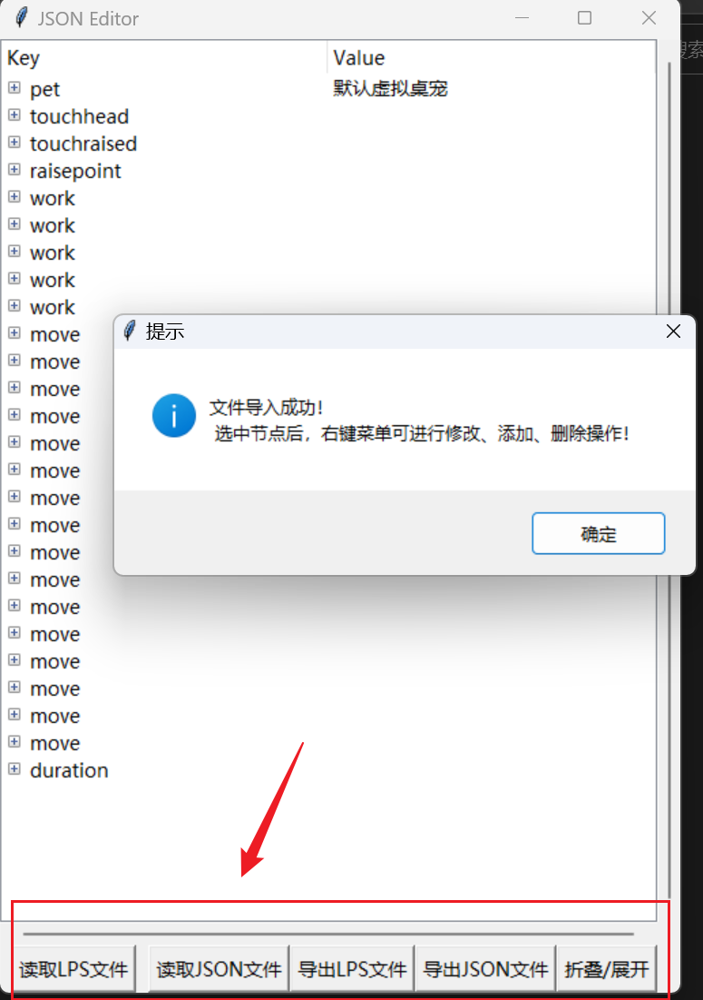
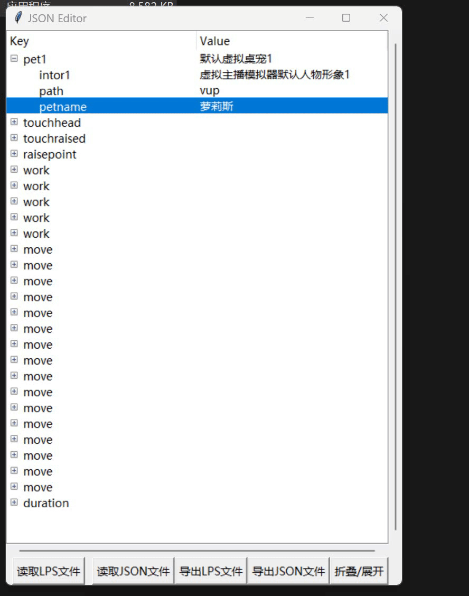
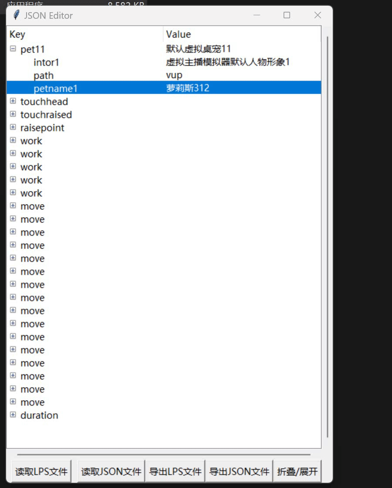
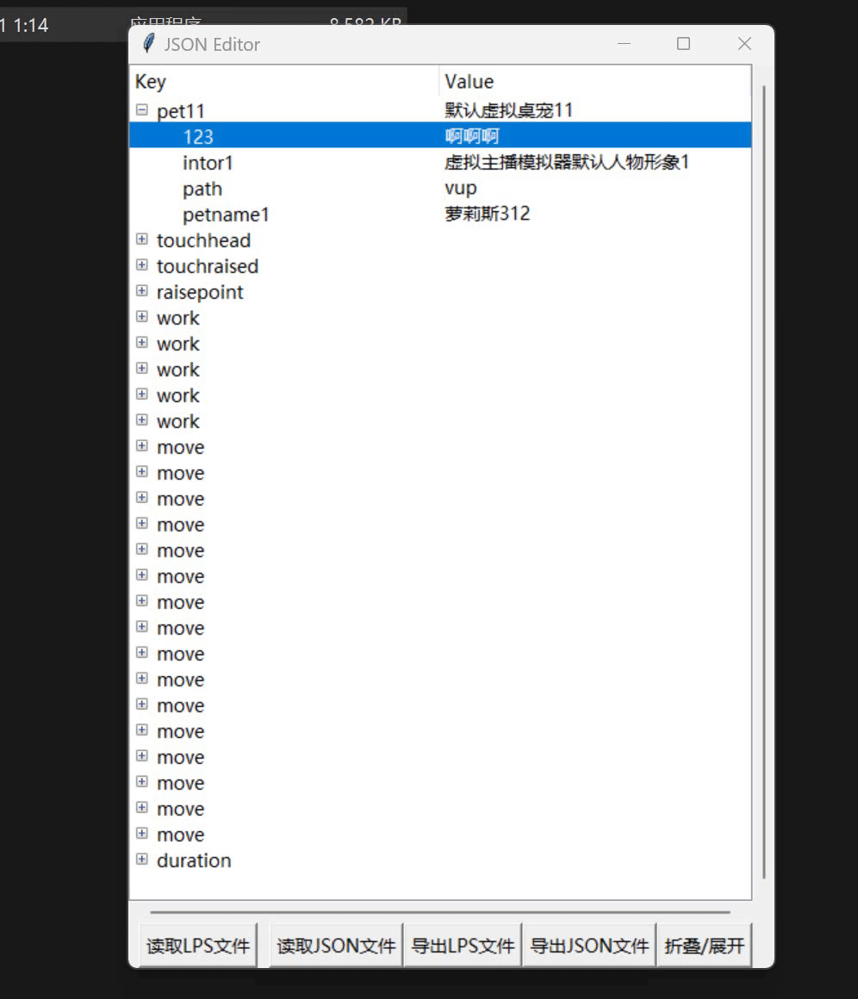

# Json_LinePutScript_Editor_Convert
 打通LPS格式文件与JSON文件转换，并且可视化编辑

# 软件说明

本软件旨在通过可视化界面对LinePutSript格式的文件进行编辑，可以套层多层递归，但考虑到插入键值对的检测问题，限制层数为2层，

1. 可以满足**虚拟桌宠模拟器**的lps文件的绝大多数文件格式，并且实现鼠标进行添加、删除、修改
2. 能够读取JSON格式文件(由于要转换为lps文件，**因此限制为2层**），并且转换为lps文件格式
3. 读取lps格式文件，并且转换为JSON格式
4. 将文件进行保存为lps或者JSON格式
5. 快速展开/折叠所有内容

用起来还是比较方便的，UI本人设计小白，UI属于能用就行：）

有能够设计新UI的可修改源码，让我参观一下佬：）

代码方面主要就封装解析函数，结构丑陋有待优化

# 使用方法

## 方法一

1. 获取程序源码，通过`pip install -r requirements.txt`补足环境

2. 运行lps_editor_ui.py文件
3. 在操作界面进行操作即可

## 方法二

1. 运行我打包好的exe程序，开始编辑即可

# 使用示意图

- 读取、保存JSON、LPS格式文件（不过多说明）

  

- 右键修改键、值数据

- 右键新建键值（限制在第一层创建）

- 右键删除节点（删除子节点/删除父节点以及子节点）

